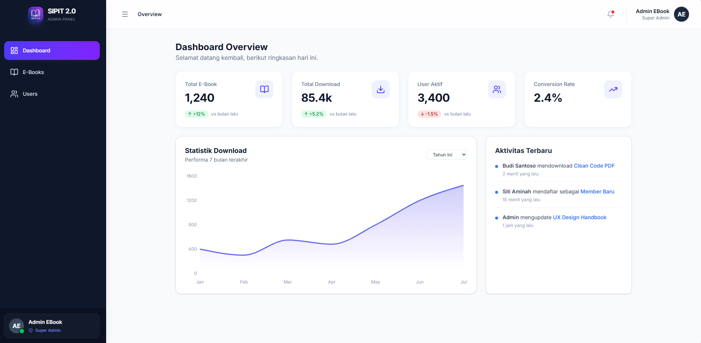

# SIPIT 2.0 — Modern E-Book Admin Dashboard


SIPIT 2.0 is a robust, production-grade admin dashboard designed for managing digital library resources. It demonstrates a modern Frontend Engineering approach with **Feature-Based Architecture**, **Type Safety**, and **Resilient UX** patterns.



## 🚀 Key Features

### 1. 🛡️ Role-Based Access Control (RBAC)
- **Dynamic UI:** Interface adapts based on user role (`Super Admin` vs `Viewer`).
- **Permission Handling:**
  - **Super Admins** have full CRUD capabilities.
  - **Viewers** are restricted to Read-Only mode (Edit/Delete buttons are disabled/hidden).
- **Self-Protection Logic:** Prevents admins from deleting their own active account to avoid lockouts.

### 2. ⚡ Advanced Data Handling
- **Mock Service Layer:** A simulated backend (`mockApi.ts`) mimics real-world latency (network delays) and random server errors to test UI resilience.
- **Client-Side Pagination:** Optimized pagination logic handling total data counts efficiently.
- **Debounced Search:** High-performance real-time search prevents API spamming.

### 3. 🧪 Engineering & Resilience
- **Global Error Boundary:** Catches application crashes and displays a user-friendly fallback UI instead of a white screen.
- **Unit Testing:** Critical business logic (Custom Hooks) is tested using **Vitest** and **React Testing Library**.
- **Type Safety:** 100% TypeScript with strict Zod validation for forms.

---

## 🛠️ Tech Stack

Built with the modern 2025 Frontend Ecosystem:

- **Core:** [React 19](https://reactjs.org/) (via [Vite](https://vitejs.dev/))
- **Language:** [TypeScript](https://www.typescriptlang.org/) (Strict Mode)
- **Styling:** [Tailwind CSS v4](https://tailwindcss.com/) + [Lucide Icons](https://lucide.dev/)
- **State Management:** [Zustand](https://github.com/pmndrs/zustand) (Persisted)
- **Form & Validation:** [React Hook Form](https://react-hook-form.com/) + [Zod](https://zod.dev/)
- **Visualization:** [Recharts](https://recharts.org/)
- **Testing:** [Vitest](https://vitest.dev/)
- **UX Components:** [Sonner](https://sonner.emilkowal.ski/) (Toast Notifications)

---

## 📂 Project Architecture

SIPIT 2.0 follows a **Feature-Based Architecture**. This ensures the codebase remains maintainable and scalable as the application grows.

```bash
src/
├── 📂 components/        # Shared UI Components (Atomic Design)
│   ├── layout/           # Sidebar, Header, Main Layout
│   └── ui/               # Reusable primitives (Modal, ErrorBoundary)
│
├── 📂 features/          # 🧠 Domain Logic (The Core)
│   ├── dashboard/        # Analytics & Charts
│   ├── ebooks/           # Book Management (Table, Forms, Hooks, Tests)
│   └── users/            # User Management (Self-protection logic)
│
├── 📂 services/          # 🔌 API Layer
│   └── mockApi.ts        # Database simulation & Network delay logic
│
├── 📂 stores/            # Global State (Zustand)
│   ├── useAuthStore.ts   # Session & RBAC
│   └── useUIStore.ts     # UI State (Sidebar)
│
├── 📂 hooks/             # Shared Custom Hooks (e.g., useDebounce)
├── 📂 lib/               # Utilities & Constants (Single Source of Truth)
└── 📂 test/              # Test Setup Configuration
```
---

## ⚡ Getting Started

Follow these steps to run the project locally:

1. **Clone repository**
```bash
git clone [https://github.com/yourusername/sipit-admin.git](https://github.com/yourusername/sipit-admin.git)
cd sipit-admin
```

2. **Install dependencies**
```bash
npm install
```

3. **Start the development server**
```bash
npm run dev
```

4. **Open your browser Visit http://localhost:5173 to see the app in action.**

---

## 🧪 Running Tests

This project uses Vitest for unit testing. To run the test suite:

```bash
npm run test
```

This will execute tests located in (`src/features/**/hooks/*.test.tsx`) to verify data fetching and filtering logic.

---

## 📄 License
This project is open-source and available under the [MIT License](./LICENSE).
